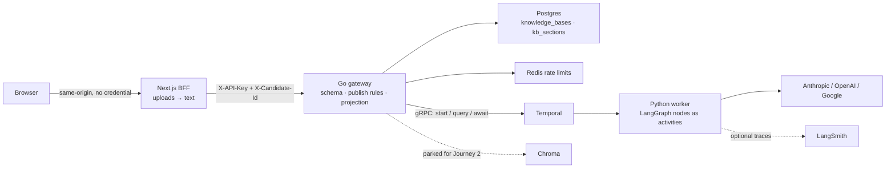
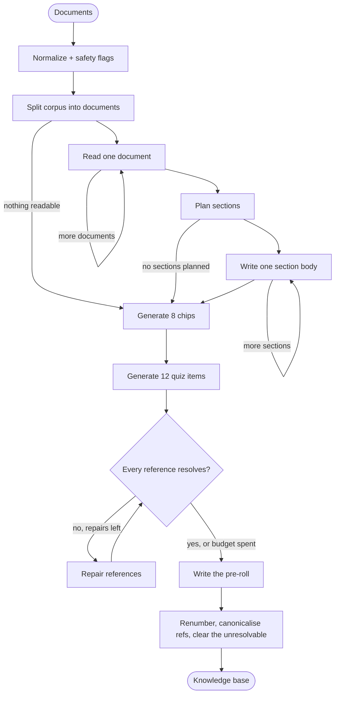

# The Reverse Interview

A recruiter has to get approved, spend an hour with a chatbot that knows the candidate,
pay for that hour, and pass a four-question test before they are allowed to book twenty
minutes of the candidate's actual time. The candidate stops repeating themselves; the
recruiter has to demonstrate they did the reading.

**This repository builds Journey 1: the candidate's authoring journey.** Documents in — a
CV, architecture write-ups, notes on why you left — and a published knowledge base out,
along with the three artifacts the recruiter side runs on.

The public API is Go — the only API surface for the domain, not a proxy. The ingestion
runtime is Python with LangChain and LangGraph, running as a Temporal worker: every graph
node executes as a Temporal activity with its own timeout and retry policy, and Temporal's
event history is what lets a two-minute ingestion survive a closed tab and a deploy. The
Next.js app in front is a BFF, not a client: it turns uploads into text and holds the
credential the browser must never see. All external dependencies sit behind small
interfaces so this repository can become the starting point for another domain.

## What this demonstrates

| Concept | Concrete implementation |
|---|---|
| Multi-step extraction | Ten nodes, two self-loops, one bounded repair cycle — not one giant call |
| Durable execution | Temporal event history persists every step; a closed tab cannot lose a run |
| Retries and timeouts | Per-node activity retry policies; a flaky call on section nine retries alone |
| Crash recovery | `Reconcile` re-attaches a completion watcher to every in-flight run at boot |
| Honest progress | One activity per document and per section, so `WRITING SECTION 4 OF 14` is a fact rather than a timer |
| Grounding | Every chip and quiz item cites a section id, verified by string comparison in three languages |
| Anti-invention | The rule the product rests on, enforced in the prompt *and* in code |
| Model portability | One adapter selects Anthropic, OpenAI, Google, or a deterministic fixture |
| Observability | Structured JSON logs, the Temporal Web UI, opt-in LangSmith traces |
| Safeguards | Input limits, prompt-injection flags, delimited source context, code-enforced caps |
| API hardening | Go edge API, typed validation, body limits, API key auth, Redis rate limits |
| Server-side withholding | The public projection is an allowlist in Go, not a CSS blur |
| Correctness | Python workflow tests on a time-skipping Temporal server, Go tests with `-race`, browser and API E2E |

`MODEL_PROVIDER=fake` is a deterministic teaching adapter. It makes the entire pipeline
testable without API cost, and it must not be mistaken for evidence that the extraction
works — see [Tests](#tests-and-quality-checks).

## Architecture



The worker serves no HTTP and owns no database. It polls a Temporal task queue, so it
scales on queue backlog rather than request concurrency, and a deploy can replace it
mid-ingestion without losing a knowledge base. It returns a result; **the gateway
persists it**, from a watcher running on a context that outlives the HTTP request.

### The ingestion pipeline



Each box maps to a node in `graph/ingest.py`. Nodes marked `execute_in: "activity"`
become Temporal activities; `sanitize`, `segment`, `verify_refs`, `assemble` and every
router run inline in the workflow, because they are pure and running them as activities
would buy four round trips and nothing else.

**The order is a dependency, not a preference.** Chips and quiz items cite sections by id,
so the sections have to exist before either is generated — which is also what turns
"is this citation real?" into an equality check instead of a hope.

A completed run's event history reads:

```
sanitize -> segment -> read_segment ×7 -> plan_sections -> write_section ×14
  -> generate_chips -> generate_quiz -> verify_refs -> write_pre_roll -> assemble
```

Three routers guard the three loops — `after_segment`, `after_plan`, `after_write` — and
they are the same question at three depths: *is there anything to iterate over?* Each one
is the difference between an empty input finishing cleanly and an `IndexError` that
Temporal retries three times before failing the run.

Two rules are enforced twice, once in the prompt and once in code, because a prompt is a
request and this product cannot be built on requests:

- **No invention, and no upgrading.** An unpaid advisory seat stays an unpaid advisory
  seat; a stated limit stays stated. An agent that flatters the candidate misrepresents
  them to a recruiter, in their name — strictly worse than the CV it replaces.
- **Every chip and quiz item names a section, and the reference must resolve.** Checked in
  the graph (`verify_refs`), in the gateway (`UnresolvedChips`) and on the review screen
  (`auditRefs`). One that still resolves to nothing after a bounded repair is *cleared*,
  so the card shows as unsourced rather than shipping a citation that leads nowhere.

## Repository map and key entry points

```text
services/
  gateway/                    Go public API — validation, auth, rate limits, persistence
    internal/api/types.go     The wire contract; mirrors the Python and zod schemas
    internal/kb/kb.go         Draft rules, publish blockers, the public projection
    internal/kb/ingest.go     Begin / Watch / Reconcile / Stream — the durability seam
    internal/kb/runtime.go    Temporal client; workflow names are a cross-language contract
    internal/store/           pgx, and the migration applied at boot under an advisory lock
    internal/httpapi/         Routing, auth, error mapping, SSE
  agent/app/
    worker.py                 Temporal worker entrypoint (start here)
    temporal/kb_workflow.py   The durable workflow: the progress query and signal
    graph/ingest.py           The pipeline and per-node execution policy
    graph/ingest_state.py     Durable typed state passed between nodes
    graph/prompts.py          The prompts, ported from TheReverseInterview/
    graph/refs.py             Reference resolution (assertion B2), worker side
    graph/progress.py         How a status line escapes an activity — read the docstring
    core/kb_schemas.py        Pydantic models — one third of the contract
    core/ingest_model.py      Provider-neutral model adapter, and the fixture oracle
    core/safety.py            Input safety boundaries
  web/                        Next.js BFF and the candidate's screens
    lib/types.ts              zod schemas — one third of the contract
    lib/refs.ts               Reference resolution (assertion B2), client side
    lib/extract.ts            PDF/markdown → one corpus; the "this is a scan" state
    app/api/kb/*              Thin proxies; `ingest` is the one that does real work
  mcp-tools/server.py         Parked. Journey 2's chat is the caller it exists for.
docs/productDocs/
  POC_UserJourney.md          The three journeys; Journey 1 in build detail
  DESIGN.md                   The RISO POSTER design language
  TheReverseInterview/        The original idea and the authored prompts
  fixtures/                   7 documents + expected.json + assertions B1–B8
tests/e2e/                    The whole stack, over the wire
deploy/k8s/                   Portable production manifest
```

The best extension points are:

- `build_ingest_graph()` to add, remove, or reorder pipeline steps.
- Node `metadata` in `graph/ingest.py` to change where a step runs and how it retries.
- `IngestionModel` to add a provider or a local model without touching a graph node.
- `store.Repository` to replace Postgres.
- `PublishBlockers` and `ToPublic` to change what "ready" means and what a stranger sees.

Two constraints are worth knowing before you edit the graph, both enforced by the
Temporal LangGraph plugin:

- Node callables must be importable from a named module. That is why the nodes are
  methods on `IngestNodes` rather than closures — closures and lambdas are rejected.
- Conditional-edge routers must be `async def`. LangGraph dispatches a sync router
  through `run_in_executor`, which the deterministic workflow event loop does not
  implement.

## Quick start

Requirements: Docker with Compose. For local development without containers, install
Python 3.13, `uv`, Go 1.26 and Node 22.

```bash
cp .env.example .env
make run                      # docker compose up --build
open http://localhost:3000    # redirects to /studio
```

The defaults run everything on `MODEL_PROVIDER=fake`, so **no API key is required** — the
worker replays `docs/productDocs/fixtures/expected.json` step by step. The Temporal Web UI
is at `http://localhost:8233` (`make ui`); open it during an ingestion to watch one
activity per document and per section, each with its own retries.

Drop the seven documents in `docs/productDocs/fixtures/` on `/studio/new`, or skip the
wait:

```bash
make seed-kb                  # the reference knowledge base, straight to `ready`
```

Ingestion is durable and streamed, so the API returns server-sent events rather than
making you poll:

```bash
curl -sSN http://localhost:8080/v1/knowledge-bases/ingest \
  -H 'X-API-Key: local-api-key' \
  -H 'X-Candidate-Id: user-arun' \
  -H 'Content-Type: application/json' \
  -d '{"title":"Arun Velasco","tagline":"Payments engineer.",
       "source_text":"# SOURCE FILE: resume.md\n\n…","source_files":["resume.md"]}'
# -> data: {"type":"draft","kb_id":"kb-…"}      the id exists before anything can fail
# -> data: {"type":"status","message":"READING 1 OF 7 FILES · resume.md"}
# -> data: {"type":"result","kb_id":"kb-…"}

curl -sS http://localhost:8080/v1/knowledge-bases/KB_ID \
  -H 'X-API-Key: local-api-key' -H 'X-Candidate-Id: user-arun'
```

`scripts/smoke.sh` does all of the above against the fixture corpus in one command.

To see durability rather than take it on trust: start an ingestion, hang up on the stream
immediately, and `docker compose restart gateway`. The new process logs
`re-attaching to an in-flight ingestion` and the knowledge base still lands.

Stop the stack with `make down`.

**If you are upgrading an existing checkout, run `make down` once.** `migrate.go` records
applied migrations, so the rewritten `0001_init.sql` will not re-run against a volume that
has already seen the old schema.

## Logging

```bash
docker compose logs -f gateway worker web
```

The worker emits structured JSON through `structlog` (`core/logging.py`), the gateway
through Go's `slog`. Both carry `kb_id` on every line that has one, so a single run is
`docker compose logs worker | grep kb-5b714eff`.

The lines worth knowing, because they are the ones that report a *quiet* problem rather
than a loud one:

| Event | Means |
|---|---|
| `ingest_safety_flags` | The corpus contained something that looked like a prompt. Flagged, not obeyed, and the run continued. |
| `unresolved_section_refs` | Chips or quiz items cited sections that do not exist. The repair pass is about to run. |
| `dropped_malformed_quiz_items` | The model returned items the gate could not render — wrong option count, out-of-range answer. |
| `thin_knowledge_base` / `thin_chips` / `thin_quiz` | Fewer artifacts than the targets. Legitimate for a sparse corpus, and also what a truncated model response looks like. |
| `empty_quiz_categories` | The gate cannot sample one question per category. This blocks publishing. |
| `ctrl_f_answerable_quiz_items` | Questions whose answer is a bare number — recall, not comprehension. A warning, never a filter. |
| `re-attaching to an in-flight ingestion` | The gateway restarted and picked a run back up. |

The Temporal Web UI at `http://localhost:8233` is usually the faster way to debug a run:
it shows every activity, its attempts, its input and output, and where a run is parked.

## API

| Method | Route | Purpose | Success |
|---|---|---|---|
| `GET` | `/healthz` | Gateway liveness | `200` |
| `GET` | `/readyz` | Readiness, including Temporal reachability | `200` / `503` |
| `POST` | `/v1/knowledge-bases/ingest` | Start a durable run; returns SSE | `200` |
| `GET` | `/v1/knowledge-bases` | The candidate's list | `200` |
| `GET` | `/v1/knowledge-bases/{id}` | The owner's copy | `200` |
| `GET` | `/v1/knowledge-bases/{id}?audience=public` | The projection a stranger gets | `200` |
| `PATCH` | `/v1/knowledge-bases/{id}` | Partial edits from the review screen | `200` |
| `POST` | `/v1/knowledge-bases/{id}/publish` | Go live | `200` / `409` |
| `POST` | `/v1/knowledge-bases/{id}/reingest` | Retry from stored source text | `200` |
| `POST` | `/v1/knowledge-bases/{id}/chips/{i}/rephrase` | Rewrite one question | `200` |
| `POST` | `/v1/vectors` | Upsert vectors. Parked for Journey 2. | `200` |

The web app mirrors these under `/api/kb/*` so the browser stays same-origin and never
holds the API key.

One envelope everywhere: `{ "error": { "code", "message", "fields?", "blockers?" } }`.
Screens branch on `code` — `no_text_layer` switches to the paste tab, `not_publishable`
lists every blocker at once, `invalid_meta` puts a message next to a field. The proxy
forwards it verbatim rather than re-deriving it, so there is no second place the contract
can drift.

Publishing returns `409` with `blockers` when the recruiter-facing screen would be
*broken*: not exactly three questions selected, or a quiz category the gate cannot sample
from. A thin knowledge base only warns — a sparse corpus still makes something worth
publishing.

### Identity, and one thing to be honest about

All routes except health require `X-API-Key`. `X-Candidate-Id` then says who is signed in,
and the gateway trusts it because the API key gates the hop. That is exactly as strong as
POC_UserJourney.md §0's dev-mode role switcher — which is to say **anything holding the
API key can act as any seeded user.** Replacing it with real authentication is the first
thing to do before this meets a real recruiter.

### The withholding rule

`?audience=public` needs no identity, because Journey 2's page is unauthenticated by
definition. It returns the pre-roll, the three selected questions' text, and section
titles and summaries. It omits **the entire quiz**, plus `why_it_lands`, section bodies and
`source_text`.

The quiz one is a security control rather than a conversion mechanic: it gates booking
twenty minutes of the candidate's real time, so a `correct_index` in a devtools panel does
not leak a teaser, it hands over the answer key. The projection is an allowlist in
`kb.ToPublic` — an omit-list would leak every field anyone adds later, quiz included.

## Model configuration

The default is Anthropic:

```dotenv
MODEL_PROVIDER=anthropic
MODEL_NAME=claude-opus-5
ANTHROPIC_API_KEY=...
```

Change only configuration to use another installed provider:

```dotenv
MODEL_PROVIDER=openai
MODEL_NAME=gpt-5-mini
OPENAI_API_KEY=...
```

or:

```dotenv
MODEL_PROVIDER=google
MODEL_NAME=gemini-3.1-pro-preview
GOOGLE_API_KEY=...
```

Model names evolve faster than application code, so verify availability in your account
before deployment. `MODEL_TEMPERATURE` is unset by default, which leaves the provider's
own default in place.

POC_UserJourney.md §0 is explicit that bigger and slower is fine here: ingestion runs once
per knowledge base and its output is edited by a human before anyone sees it. Journey 2's
chat is the latency-sensitive one and it will want a different model.

`MODEL_PROVIDER=fake` replays `docs/productDocs/fixtures/expected.json` and is what CI,
the compose stack and the browser smoke run on. `ENVIRONMENT=production` refuses to start
with it.

The code-enforced caps travel with the worker and exist so a model that ignores its prompt
still cannot produce an unusable knowledge base:

```dotenv
MAX_SOURCE_CHARS=400000   # above this a corpus is a paste bomb
MAX_SECTIONS=16           # a forty-section knowledge base is one nobody reads
MAX_CHIPS=8               # eight generated, three selected
MAX_QUIZ_ITEMS=12         # three per category
```

`INGEST_TIMEOUT_MINUTES` is owned by the gateway rather than the worker, because workflow
code cannot read the environment — it travels as a `StartWorkflowOptions` field.

Retrieval is parked. `EMBEDDING_MODEL` and `CHROMA_COLLECTION` must hold the same value on
the gateway and the worker whenever Journey 2 turns it on: the gateway writes the vectors
the worker would query, and a mismatch degrades retrieval silently rather than loudly.
Journey 1 needs none of it — a knowledge base is under 60k tokens and the whole thing goes
in the prompt.

## LangSmith

LangChain and LangGraph pick up the standard tracing environment variables inside
activities:

```dotenv
LANGSMITH_TRACING=true
LANGSMITH_API_KEY=...
LANGSMITH_PROJECT=reverse-interview
```

Temporal also ships a LangSmith plugin, but this project does not use it: its extras pin
`langsmith<0.9` while `langchain-core` requires `>=0.3.45,<1.0.0`, so installing it would
force an unsatisfiable resolution. The environment variables above cover the same ground.

Create separate projects for development, staging and production. The evaluation
dimensions that matter here are not the usual ones — they are **whether the pipeline told
the truth about a person**: no upgrading of scope, the employment gap intact, stated limits
surfaced rather than buried, and every citation resolvable. Those are assertions B3–B7 in
[`fixtures/README.md`](docs/productDocs/fixtures/README.md), and `make eval` runs them.

## Ingestion, and how it can fail

Every failure state is a designed screen, not a toast:

| Failure | What happens |
|---|---|
| PDF with no text layer | *"This looks like a scan. Paste the text instead."* — the form switches to the paste tab. Never reaches the Go API. |
| Fewer than 8 chips, or fewer than 12 quiz items | Warns. Never blocks: a sparse corpus still makes a knowledge base worth publishing. |
| A quiz category with nothing in it | **Blocks.** The gate samples one item per category, so this is a gate that cannot run. |
| Not exactly three chips selected | **Blocks.** A front page with two questions on it is a broken screen. |
| A question citing a deleted section | Hatch-gutter warning on the card, live as you delete it. |
| Pipeline dies mid-run | The draft survives with its source text; `[RETRY]` re-runs it with no re-upload. |
| Tab closed mid-run | The watcher persists the result anyway. |
| Gateway restarts mid-run | `Reconcile` re-attaches at boot and the run still lands. |

Worth trying by hand:

```
# Closed tab: start an ingest, close the tab, reopen /studio a minute later.
# Restart:    start an ingest, then `docker compose restart gateway`.
# Failure:    `docker compose stop worker`, ingest, then start it and retry.
# Scan:       drop an image-only PDF and read the message.
```

## Tests and quality checks

```bash
make install       # the locked toolchain: uv sync, go mod download, npm ci
make lint          # ruff · gofmt/vet · eslint + tsc
make test-unit     # pytest · go test -race · vitest
make test-e2e      # the whole stack: browser smoke first, then the API suite
make eval          # the judgement assertions, against a real model (costs money)
```

Python workflow tests run against Temporal's time-skipping test server, so the suite
finishes in seconds with no Temporal server and no Docker. `make test-e2e` starts with
`docker compose down -v`, because the Playwright smoke asserts the designed empty state
and runs before the API suite for the same reason.

**What the unit tests can and cannot prove.** The fixture model is an oracle: it answers
each step with `expected.json` rather than reasoning. So the unit suites prove the
*pipeline* — documents split and read in order, ordinals assigned, malformed quiz items
dropped, an unresolvable reference repaired and then cleared, the caps holding, an empty
corpus finishing cleanly instead of crashing.

They do not prove the extraction. Assertions B3 (no invention), B4 (the gap survives), B5
(limits surfaced), B6 (chip register mix) and B7 (quiz distractor quality) are claims about
a *model's judgement*, and only `make eval` against a live provider can check them.
Pretending otherwise would be a test suite that proves nothing while looking thorough.

`tests/e2e/` is the only test that exercises the cross-language contract for real: the Go
structs, the Pydantic models and the zod schemas agree by convention, and a renamed JSON
tag surfaces as a workflow task failure or a client-side parse error rather than a compile
error. CI repeats every check, runs Go's race detector, and builds all application images.

## Production deployment

Use Temporal Cloud or a self-hosted cluster; use managed Postgres; run the gateway
publicly and keep the worker on private networking — it needs no ingress whatsoever. The
portable Kubernetes example and cloud-service mapping are in
[`docs/deployment.md`](docs/deployment.md); a Railway walkthrough is in
[`docs/railway.md`](docs/railway.md).

Production work that is intentionally left undone:

- Replace the trusted `X-Candidate-Id` header with real authentication.
- Object storage for the original uploads; today only the extracted text is kept.
- LinkedIn OAuth and the email approve/reject loop that gates a recruiter.
- Payments, the hour's cost meter, and the booking calendar.
- A Temporal retention policy and archival for closed histories.
- Back up Postgres and verify a restore before the first real candidate signs up.

## What is parked

`services/mcp-tools` and the Chroma vector store behind `POST /v1/vectors` are retained
from the reference application this repository grew out of. Nothing in Journey 1 calls
them. They stay because Journey 2's hour-long chat will need tools and, at a large enough
knowledge base, retrieval — but at Journey 1's size the whole thing goes in the prompt, and
adding RAG now would be complexity with no reader.

## Why the services are split

Go owns the stable public contract and every cross-cutting edge concern: authentication,
validation, rate limiting, HTTP semantics, persistence, and the projection that decides
what a stranger sees. It is the thing that must not fall over. Python owns the fast-moving
model ecosystem and the LangGraph reasoning. Temporal sits between them and owns
durability, retries, timeouts and crash recovery — which is why there is no job table, no
queue and no retry loop in this codebase, and why closing a tab thirty seconds into a
two-minute ingestion costs nothing.

The web app is a BFF rather than a client for two reasons: the gateway's API key must
never reach a browser, and PDF extraction belongs where pdf.js is.

This separation gives future projects clear seams without turning a small application into
a large microservice estate.
