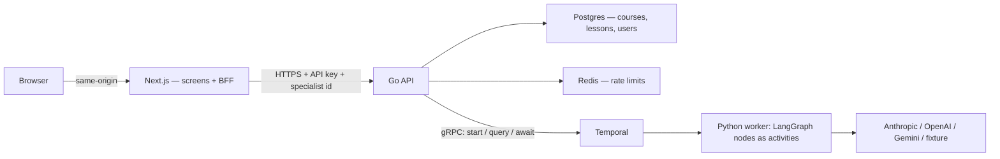
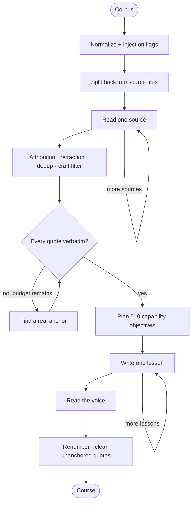

# Chat-Native Tutoring — Journey 1

A Specialist drops a folder of messy notes — a manuscript, podcast transcripts, an AMA
thread — and ten minutes later has a live course, without ever writing a prompt. That is
Journey 1 of the POC specified in
[`docs/productDocs/POC_UserJourney.md`](docs/productDocs/POC_UserJourney.md), and it is
what this repository implements.

The interesting part is not the CRUD. It is that **a course's positions are the paid
product** — the things this person believes that most people don't — and pulling them out
of raw material is a judgement problem with expensive failure modes. A podcast guest
arguing against the author reads exactly like the author being contrarian. A rule stated
in chapter two and publicly walked back in a newsletter six months later reads like a
strong opinion. A page of perfectly good craft reads like expertise. Get any of those
wrong and you ship a tutor that argues, in the Specialist's voice, for things the
Specialist does not believe.

```
Browser ──same-origin /api/courses/*──▶ Next.js (BFF)
                                          │  uploads → text, cookie → identity
                                          ▼
                                     Go API ──▶ Postgres
                                          │
                                          │ gRPC: start / query / await
                                          ▼
                                     Temporal ──▶ Python worker
                                                  LangGraph nodes as activities
```

## Architecture



**Who owns what.** Go owns persistence, validation, the publish rules, the public
projection and the ingest SSE stream. The Python worker owns the model and returns a
course; it has no database. Next owns file-to-text, identity and rendering — it is a BFF,
not an API, so the browser never holds the gateway's key.

The worker serves no HTTP. It polls a Temporal task queue, so it scales on queue backlog
rather than request concurrency, and a deploy can replace it mid-ingestion without losing
a course.

### The ingestion pipeline

`POC_UserJourney.md` sketches ingestion as "a single LLM call, streamed, ~30–60s". This
is not that, and the reason is
[`docs/productDocs/fixtures/README.md`](docs/productDocs/fixtures/README.md).

The fixture's traps are not prompt problems, they are attention problems: one pass over
six heterogeneous sources has to hold *who is speaking*, *what was walked back later* and
*what is merely correct* in mind at once, and it drops one. So each source is read on its
own, and the decisions are made afterwards, when every source is in view.



Each box maps to a node in
[`services/agent/app/graph/ingest.py`](services/agent/app/graph/ingest.py). Nodes marked
`execute_in: "activity"` become Temporal activities with their own timeout and retry
policy; the pure ones (`sanitize`, `segment`, `verify_quotes`, `assemble`) run inline in
the workflow. The two self-loops are deliberate: one activity per source file and one per
lesson means a flaky call on lesson four retries in isolation instead of restarting the
ingestion, and one enormous generation cannot hit a max-token wall.

Open the Temporal UI (`make ui`) during a run and you will see exactly that shape.

## What this demonstrates

| Concept | Concrete implementation |
|---|---|
| Multi-step agent pipeline | Ten LangGraph nodes with two bounded loops and three routers |
| Durable execution | Temporal event history persists every step; a run survives a worker restart |
| Retries and timeouts | Per-node activity retry policies; one lesson's failure retries alone |
| Streaming progress | Node → activity signal → workflow query → SSE, with no percentage to fake |
| Grounding | Every position carries a verbatim source quote, verified in code |
| Defence in depth | Attribution is enforced by the graph, not only asked for in the prompt |
| Model portability | One `IngestionModel` interface selects Anthropic, OpenAI, Gemini, or a fixture |
| Authorization | Ownership checked per course; the public projection is an allowlist |
| API hardening | Go edge API, typed validation, body limits, API key auth, Redis limits |
| Correctness | Go, Python and TypeScript unit tests, plus a browser and API run over the real stack |
| Model evaluation | The fixture's judgement traps, as an opt-in eval against a live provider |

## Quick start

Requirements: Docker with Compose.

```bash
cp .env.example .env
make run                 # postgres, temporal, gateway, worker, web
open http://localhost:3000/studio
```

That works with no API key. `MODEL_PROVIDER` defaults to `fake`, which replays
`docs/productDocs/fixtures/expected.json` step by step — deterministic, instant, and what
CI runs. For real ingestion:

```dotenv
MODEL_PROVIDER=anthropic
MODEL_NAME=claude-opus-5
ANTHROPIC_API_KEY=...
```

Then walk it: `BUILD A COURSE` → drop `docs/productDocs/fixtures/source.md` → watch the
halftone panel stream a status line per source and per lesson → the review screen opens
on **Positions** → reorder a lesson, soften a claim, edit the voice card → `PREVIEW AS A
STUDENT` → `PUBLISH`.

```bash
make seed-course         # optional: the reference course, without waiting on a model
make ui                  # Temporal: one activity per source file and per lesson
docker compose logs -f worker
```

An empty studio is a designed screen — "No courses yet. Make one." — which is why seeding
is opt-in.

## Repository map

```text
services/
  gateway/                        Go API — the only thing that touches Postgres
    internal/api/types.go         The wire contract; mirrors the Pydantic and zod schemas
    internal/courses/             Draft rules, publish rules, public projection, Temporal seam
    internal/courses/ingest.go    The completion watcher and the SSE stream
    internal/store/               Repository interface, pgx implementation, embedded migrations
    internal/httpapi/             Routing, auth, error mapping
    cmd/seed/                     Fixture → a ready course, without a model
  agent/app/
    worker.py                     Temporal worker entrypoint (start here)
    graph/ingest.py               The pipeline and per-node execution policy
    graph/prompts.py              One prompt per step, each carrying one fixture trap
    graph/anchors.py              Verbatim quote checking — assertion A2, in the product
    graph/progress.py             How a status line escapes an activity
    core/ingest_model.py          Provider-neutral model adapter, and the fixture replay
    core/course_schemas.py        The Temporal payload contract
    core/safety.py                Input safety boundary
    temporal/course_workflow.py   The durable workflow, its query and its signal
  web/                            Next.js screens, and the BFF in front of the Go API
    lib/gateway.ts                The one place this app talks to Go
    lib/extract.ts                Uploads → text, including the "this is a scan" state
    app/api/courses/              Thin proxies; only `ingest` does more than forward
  mcp-tools/                      Parked for Journey 3's four-tool loop
docs/productDocs/                 Product spec, design system, and the ingestion fixture
tests/e2e/                        Journey 1 against the running stack
deploy/k8s/                       Portable production manifest
```

The best extension points:

- `build_ingest_graph()` to add, remove or reorder pipeline steps.
- Node `metadata` in `graph/ingest.py` to change where a step runs and how it retries.
- `IngestionModel` to add a provider or a local model without touching a graph node.
- `store.Repository` to replace Postgres.
- `MAX_LESSONS` / `MAX_POSITIONS` for the shape of a course.

Two constraints are worth knowing before you edit the graph, both enforced by the
Temporal LangGraph plugin:

- Node callables must be importable from a named module. That is why the nodes are
  methods on `IngestNodes` rather than closures — closures and lambdas are rejected.
- Conditional-edge routers must be `async def`. LangGraph dispatches a sync router
  through `run_in_executor`, which the deterministic workflow event loop does not
  implement.

## API

The browser talks to the Next app; the Next app talks to this. Both surfaces exist
because the API key must not reach a browser.

| Method | Route | Purpose | Success |
|---|---|---|---|
| `GET` | `/healthz` | Liveness. Never depends on Temporal | `200` |
| `GET` | `/readyz` | Readiness, including Temporal reachability | `200` / `503` |
| `GET` | `/v1/courses` | The studio list, scoped to the caller | `200` |
| `POST` | `/v1/courses/ingest` | Text + meta → a draft and an SSE stream | `200` |
| `GET` | `/v1/courses/{id}` | The owner's copy, or `?audience=public` | `200` |
| `PATCH` | `/v1/courses/{id}` | Partial edits from the review screen | `200` |
| `POST` | `/v1/courses/{id}/publish` | Go live, or `409` with every blocker | `200` |
| `POST` | `/v1/courses/{id}/reingest` | Retry from stored source text | `200` |
| `POST` | `/v1/courses/{id}/positions/{i}/soften` | One claim rewrite, via a workflow | `200` |
| `POST` | `/v1/knowledge` | Upsert knowledge documents (parked; see below) | `200` |

Every route except health requires `X-API-Key` or `Authorization: Bearer ...`.

`POST /v1/courses/ingest` takes **text, not files**. Turning an upload into text lives in
`services/web/lib/extract.ts`: pdf.js is materially better at it than anything in Go, the
designed *"This looks like a scan. Paste the text instead."* state is already built around
it, and raw PDF bytes never go near Temporal's payload limit.

### Errors

One envelope, everywhere, because the screens branch on `code`:

```json
{"error": {"code": "not_publishable", "message": "Set a price.", "blockers": ["…", "…"]}}
```

### Identity, and one thing to be honest about

The gateway trusts `X-Specialist-Id` because the API key gates that hop and the only
caller is the web app, which resolves it from a signed-in cookie. That is the server-side
half of the `SIGN IN AS` switcher, and it is exactly as strong as POC_UserJourney.md §0
says — "real auth is a Monday problem". **Anything holding the API key can act as any
seeded user.** Replacing this with a real token is the first thing to do before the
service meets a real user.

## Ingestion, and how it can fail

The draft row is written **before** the model runs. That single ordering is what makes
every failure recoverable: a run that times out leaves a course with its source text
intact and a `[RETRY INGESTION]` button, not a lost upload.

Two independent things then happen. A **completion watcher** on its own context waits for
the workflow and persists the result — so closing the tab cannot lose a finished course —
and on boot the gateway re-attaches a watcher to every run still in flight, so a deploy
mid-ingestion cannot either. Separately, the request **streams** status: it reads lines
from the workflow query but terminal state from the database, so a "ready" can never
arrive before the lessons it promises.

All four of these are built, and worth trying:

```bash
# Closed tab: start an ingest, close the tab, reopen /studio a minute later.
# Restart:    start an ingest, then `docker compose restart gateway`.
# Failure:    `docker compose stop worker`, ingest, then start it and retry.
# Scan:       drop an image-only PDF and read the message.
```

## Tests and quality checks

```bash
make lint                # ruff, gofmt + go vet, eslint + tsc
make test-unit           # pytest, go test -race, vitest
make test-e2e            # the whole stack: browser first, then API
make eval                # the fixture's traps against a real model (costs money)
```

The fixture in [`docs/productDocs/fixtures/`](docs/productDocs/fixtures/) is one
end-to-end test case with seven assertions, and the split between what is *tested* and
what is *evaluated* is deliberate:

- **A2 (quote anchoring)** is a string match, so it runs in CI — and in the product, on
  every ingestion, clearing any quote it cannot find rather than shipping a fabricated
  citation.
- **A1 and A7** (lesson shape, position count) are enforced in code as caps, and tested.
- **A3 (the guest trap)** is enforced twice: the prompt asks the reader to mark who spoke,
  and `resolve_positions` then *drops* those candidates in code. A model that forgets rule
  one still cannot produce a tutor arguing a guest's position.
- **A3–A6 as judgement** — did the model actually notice the walkback, the restatement,
  the craft? — cannot be checked by a fixture that replays the right answer. Those are
  `make eval`, against a live provider, marked and skipped by default. Run them before and
  after changing `graph/prompts.py`.

`make test-e2e` runs the browser smoke first, because it asserts the designed empty state
and the API suite leaves courses behind.

## Production deployment

Use Temporal Cloud or a self-hosted cluster; use managed Postgres and Redis. Run the
gateway and the web app publicly and keep the worker on private networking — it needs no
ingress whatsoever. The portable Kubernetes example is in
[`docs/deployment.md`](docs/deployment.md).

Work that is intentionally left undone:

- Real authentication, replacing the trusted `X-Specialist-Id` header.
- Tenant-aware authorization and tenant-scoped courses.
- Provider moderation and organization policy checks for your risk profile.
- A Temporal retention policy and archival for closed histories.
- Object storage for original uploads; only the extracted text is kept today.

## What is parked

Journeys 2 (catalog, course page, sample chat, checkout) and 3 (the tutor loop, the four
tools, citation chips) are not built. Two things stay wired for them rather than deleted:

- **Chroma** and `POST /v1/knowledge` — nothing reads these vectors back yet. Journey 1
  needs no RAG at all: POC_UserJourney.md §0 is explicit that a course is under 60k tokens
  and the whole thing goes in the prompt.
- **`services/mcp-tools`** — it currently serves demo tools from the support-ticket
  reference application this repository grew out of, and nothing calls them. Journey 3's
  loop is four tools (`get_lesson`, `mark_progress`, `quiz`, `ask_specialist`) and this is
  where they go.

Everything Journey 1 built — `PositionCard`, `SyllabusRail`, `ProgressMeter`, `Thread`,
the `users`/`courses`/`lessons` tables, the SSE plumbing, the fixture-model convention —
is something those journeys reuse.

## Why the services are split

Go owns the stable, high-concurrency public contract and every cross-cutting edge concern:
authentication, validation, rate limiting, HTTP semantics, and persistence. Python owns
the fast-moving model ecosystem and the LangGraph pipeline. Temporal sits between them and
owns durability, retries and timeouts — which is why a two-minute ingestion survives a
deploy, and why a wedged model call becomes a retryable draft rather than a spinner
forever.

Next sits in front as a BFF rather than as a second API. It exists to keep the API key out
of the browser and to do the one thing genuinely better done in JavaScript, which is
pulling text out of a PDF.
